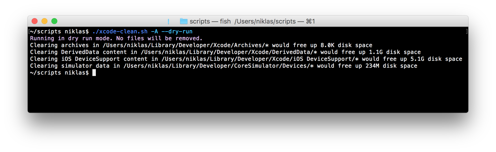

# xcode-clean.sh
Bash script freeing up disk space by removing Xcode generated data



## Usage
```
$ ./xcode-clean.sh -h
Usage: ./xcode-clean.sh [options]

Frees up disk space by removing Xcode data. NOTE: you might want to keep backups of the dsym files in ~/Library/Developer/Xcode/Archives

EXAMPLE:
    ./xcode-clean.sh -A

OPTIONS:
   -h           Show this help message
   -a           Remove all Xcode archives
   -d           Remove everything in DerivedData folder
   -D           Remove everything in DeviceSupport folder
   -s           Remove simulator data
   -A           Remove all of the above(archived, DerivedData and simulator data)
   --dry-run    Dry run mode prints which directories would be cleared but don't remove any files

```
